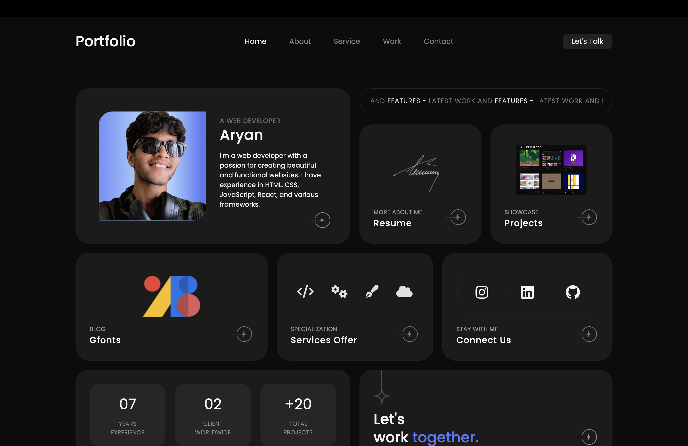

This is a responsive personal portfolio website built using HTML, CSS, and JavaScript. The website showcases my skills, projects, and contact information in a clean and professional design.

🔥 Features
	•	✅ Fully responsive design (mobile, tablet, desktop)
	•	🎯 Smooth scroll and interactive animations
	•	💼 Project showcase section
	•	🙋‍♂️ About Me and Skills section
	•	📬 Contact form with validation (if included)
	•	📁 Organized and clean code structure

🚀 Technologies Used
	•	HTML5
	•	CSS3 (Flexbox & Media Queries)
	•	JavaScript (Vanilla JS)

🖼️ Preview

